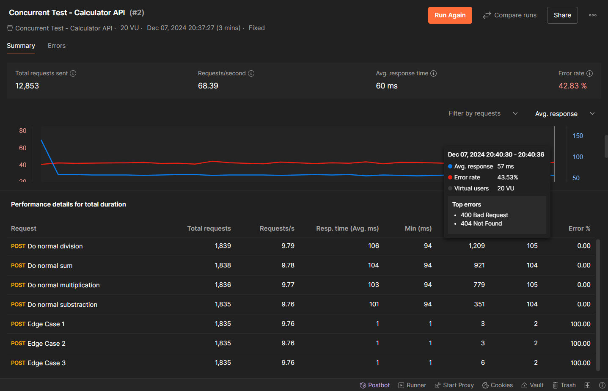
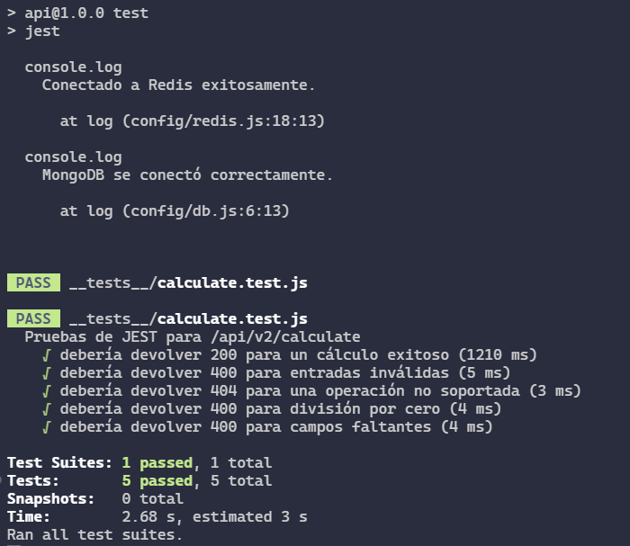

# Calculator API


A scalable API for basic arithmetic operations with features like input validation, caching, error handling, and monitoring.

## **Progress**

- [x] **API Endpoint**: Accepts two numbers and an operation type.
- [x] **Supported Operations**: Addition (+), Subtraction (-), Multiplication (\*), Division (/).

- [x] **Asynchronous Processing**: Use asynchronous handling (e.g., Promises) to ensure a non-blocking API flow.

- [x] **Database Integration**: Log all requests and responses in a MongoDB database, including:

  - [x] Operation type.
  - [x] Input numbers.
  - [x] Calculated result.
  - [x] Request timestamp.
  - [x] Response time.

- [x] **Caching**: Implement Redis to cache results for repeated calculations with a TTL (e.g., 60 seconds).

- [x] **Input Validation**: Validate inputs using libraries like Joi or Yup to handle:

  - [x] Non-numeric inputs.
  - [x] Division by zero.
  - [x] Missing/invalid operation type.
  - [x] Excessive input size.

- [x] **Error Handling**: Return detailed error messages in a consistent JSON format with appropriate HTTP status codes:

  - [x] `400 Bad Request` for invalid inputs.
  - [x] `404 Not Found` for unsupported operations.
  - [x] `500 Internal Server Error` for unexpected issues.

- [x] **Response Format**: Return results in a JSON structure:

  ```json
  {
      "status": "success",
      "operation": "<operation>",
      "inputs": {
          "number1": <number1>,
          "number2": <number2>
      },
      "result": <result>,
      "timestamp": "<timestamp>",
      "responseTime": "<response_time_in_ms>"
  }
  ```

- [x] **Scalability**: Ensure the API is stateless and handles concurrent requests efficiently.
  - [x] Concurrent testing done with Postman. Download the [Postman Collection](./assets/postman/Concurrent%20Test%20-%20Calculator%20API.postman_collection.json) to replicate the tests.



- [x] **Deployability**: Deploy with scalable tools like Docker and Kubernetes.

  - [x] Deployed the API endpoint by building a Docker image and running it on a network where another Redis container runs. For instructions, check this [Running the Application with Docker](#running-the-application-with-docker).

- [X] **Security**: Use HTTPS for secure communication.

  - [X] Implement rate-limiting to prevent abuse.
  - [X] Sanitize inputs to guard against injection attacks.
  - [X] Protect sensitive data and handle CORS.

- [X] **Testing with Jest**: Create unit and integration tests with Jest for:

  - [X] Successful operations.
  - [X] Edge cases (e.g., division by zero).
  - [X] Error-handling scenarios.



- [X] **API Documentation**: Provide comprehensive Swagger/OpenAPI documentation detailing endpoints, parameters, and example responses.

- [ ] **Deployment**: Deploy to a cloud platform like AWS, GCP, or Azure.

- [ ] **CI/CD**: Use CI/CD pipelines for automated testing and seamless deployment.

- [ ] **Monitoring**: Use tools like Prometheus and Grafana for health, latency, and error rate tracking.

  - [ ] Log performance metrics centrally with tools like ElasticSearch or CloudWatch.

- [x] **Versioning**: Implement versioning (e.g., `/v1/`) to accommodate future updates without disrupting existing clients.

---

## **Usage**

1. Clone the repo:
   ```bash
   git clone https://github.com/Txaverria/Calculate-API-Endpoint.git
   ```
2. Install dependencies:
   ```bash
   npm install
   ```
3. Configure `.env`:
   ```plaintext
   PORT=3000
   REDIS_HOST=localhost
   REDIS_PORT=6379
   MONGO_URI=INPUT_YOUR_OWN_MONGO_URI
   ```
4. Start the server:
   ```bash
   npm start
   ```
5. Access the API: `http://localhost:3000/api/v2/calculate` (for the v2 version incl)

## **Running the Application with Docker**

Follow these steps to run the application using Docker. Ensure you have Docker installed and running on your system.

### 1. Build the Docker Image

Build the Docker image for the application:

```bash
docker build -t my_api .
```

### 2. Create a Docker Network

Create a custom Docker network to allow communication between the app and Redis containers:

```bash
docker network create my_app_network
```

### 3. Run the Redis Container

Start a Redis container connected to the custom network:

```bash
docker run -d \
  --name my_redis \
  --network my_app_network \
  -p 6380:6379 \
  redis
```

This runs Redis on the internal port `6379` and maps it to port `6380` on the host (this is due to some versions of WSL for Windows 10 running on port 6379).

### 4. Add Environment Variables

Ensure you have an `.env` file in the root of your project directory with the following content:

```plaintext
REDIS_HOST=my_redis
REDIS_PORT=6379
```

This file configures the app to connect to the Redis container.

### 5. Run the API Container

Run the API container, connecting it to the same network:

```bash
docker run -d --name my_api_container --network my_app_network -p 3000:3000 --env-file .env my_api
```

This exposes the application on port `3000` and ensures it uses the `.env` file for configuration.

### 6. Test the Application

- Access the API at `http://localhost:3000` using Postman or any browser.
- The app will communicate with Redis internally via the Docker network.

### 7. Stopping and Cleaning Up

To stop and remove the containers:

```bash
docker stop my_api_container my_redis
docker rm my_api_container my_redis
```

To remove the custom Docker network:

```bash
docker network rm my_app_network
```

---

### Notes

- Modify the `.env` file as needed to customize your Redis or application configuration.
- Ensure Docker is running before executing the commands.
- Update the `Dockerfile` and `.dockerignore` as necessary for your project's needs.

## **Original Project Instructions**

This project outlines the development of a scalable, secure, and efficient API endpoint for basic arithmetic operations with the following key features and requirements:

### **Core Functionality**

- **API Endpoint**: Accepts two numbers and an operation type.
- **Supported Operations**: Addition (+), Subtraction (-), Multiplication (\*), Division (/).

---

### **Advanced Requirements**

#### **Backend Architecture**

1. **Asynchronous Processing**:
   - Use asynchronous handling (e.g., Promises) to ensure a non-blocking API flow.
2. **Database Integration**:
   - Log all requests and responses in a MongoDB database, including:
     - Operation type.
     - Input numbers.
     - Calculated result.
     - Request timestamp.
     - Response time.
3. **Caching**:
   - Implement Redis to cache results for repeated calculations with a TTL (e.g., 60 seconds).

#### **Input Validation**

- Validate inputs using libraries like Joi or Yup to handle:
  - Non-numeric inputs.
  - Division by zero.
  - Missing/invalid operation type.
  - Excessive input size.

#### **Error Handling**

- Return detailed error messages in a consistent JSON format with appropriate HTTP status codes:
  - `400 Bad Request` for invalid inputs.
  - `404 Not Found` for unsupported operations.
  - `500 Internal Server Error` for unexpected issues.

#### **Response Format**

- Return results in a JSON structure:
  ```json
  {
      "status": "success",
      "operation": "<operation>",
      "inputs": {
          "number1": <number1>,
          "number2": <number2>
      },
      "result": <result>,
      "timestamp": "<timestamp>",
      "responseTime": "<response_time_in_ms>"
  }
  ```

---

### **Additional Requirements**

#### **Scalability**

- Ensure the API is stateless and handles concurrent requests efficiently.
- Deploy with scalable tools like Docker and Kubernetes.

#### **Security**

- Use HTTPS for secure communication.
- Implement rate-limiting to prevent abuse.
- Sanitize inputs to guard against injection attacks.
- Protect sensitive data and handle CORS.

#### **Testing**

- Create unit and integration tests for:
  - Successful operations.
  - Edge cases (e.g., division by zero).
  - Error-handling scenarios.
- Use testing frameworks like Jest or Mocha.

#### **API Documentation**

- Provide comprehensive Swagger/OpenAPI documentation detailing endpoints, parameters, and example responses.

#### **Deployment**

- Deploy to a cloud platform like AWS, GCP, or Azure.
- Use CI/CD pipelines for automated testing and seamless deployment.

#### **Monitoring**

- Use tools like Prometheus and Grafana for health, latency, and error rate tracking.
- Log performance metrics centrally with tools like ElasticSearch or CloudWatch.

#### **Versioning**

- Implement versioning (e.g., `/v1/`) to accommodate future updates without disrupting existing clients.

This project ensures a robust, user-friendly API designed for efficiency, scalability, and security.
